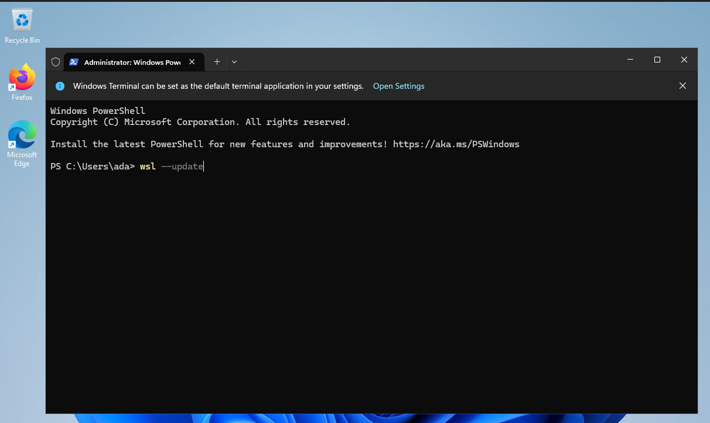
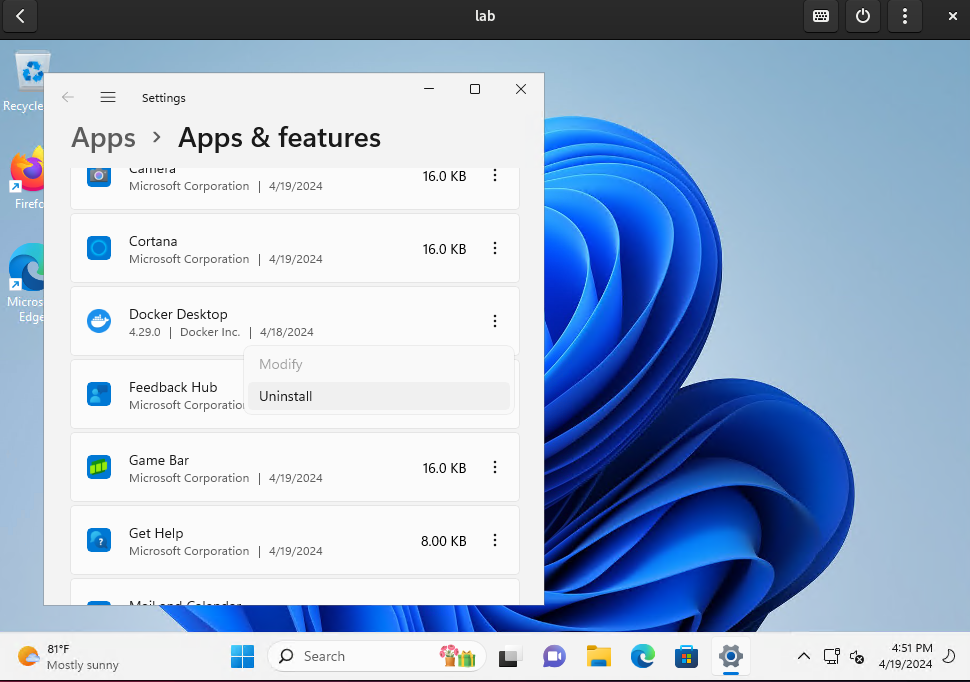
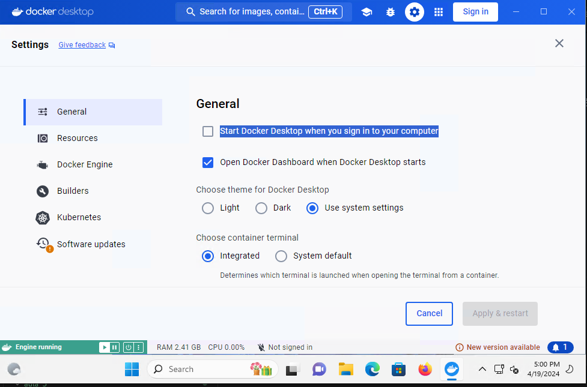
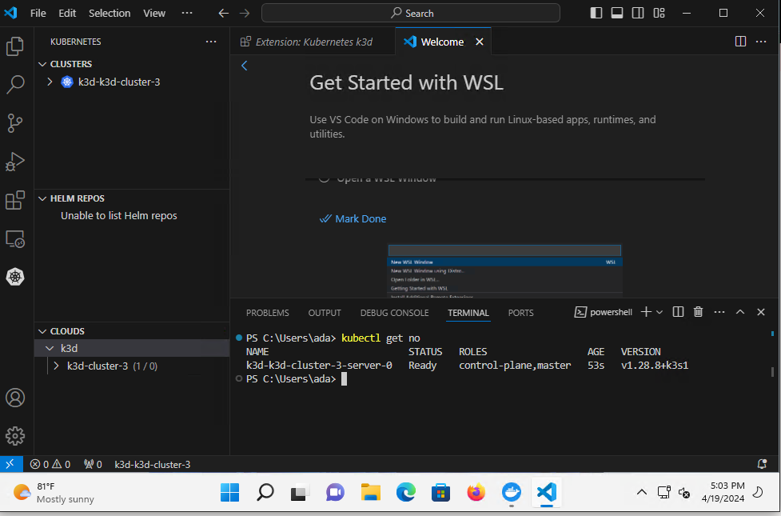

# Steps para configuração do laboratório

## 1 - WSL Update (Administrador)

Rodar como Administrador

```BASH
wsl --update
```



## 2 - Desinstalar o Docker



## 3- Instalar o Docker novamente

[Download Docker](https://desktop.docker.com/win/main/amd64/Docker%20Desktop%20Installer.exe?_gl=1*mhldd8*_ga*MTY5MDg5MjgxLjE3MTM1NDU1NTQ.*_ga_XJWPQMJYHQ*MTcxMzU0NTU1NC4xLjEuMTcxMzU0NTU2Mi41Mi4wLjA.)

## 4 - Reiniciar o laboratório

Reiniciar se a maquina não reiniciar sozinha

## 5 - Abrir/Iniciar o Docker

O Docker deve ser iniciado toda vez q a maquina for iniciada.

**Sugestão**: Configurar o Docker para iniciar com a maquina



## 6 - Instalar a extensão k3D no VS Code

Abrir o VS Code e instalar a extensão `k3d`


